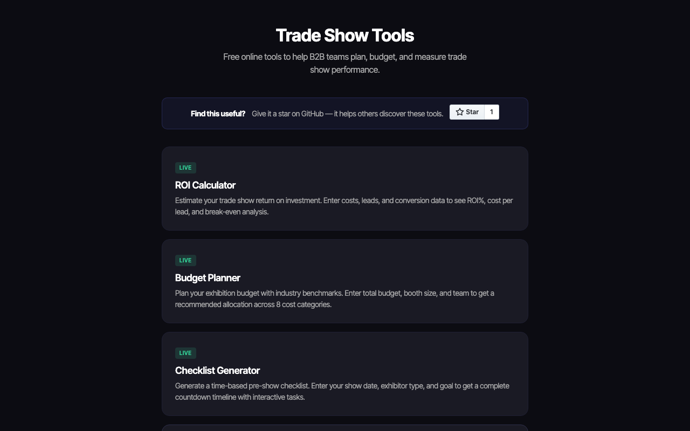
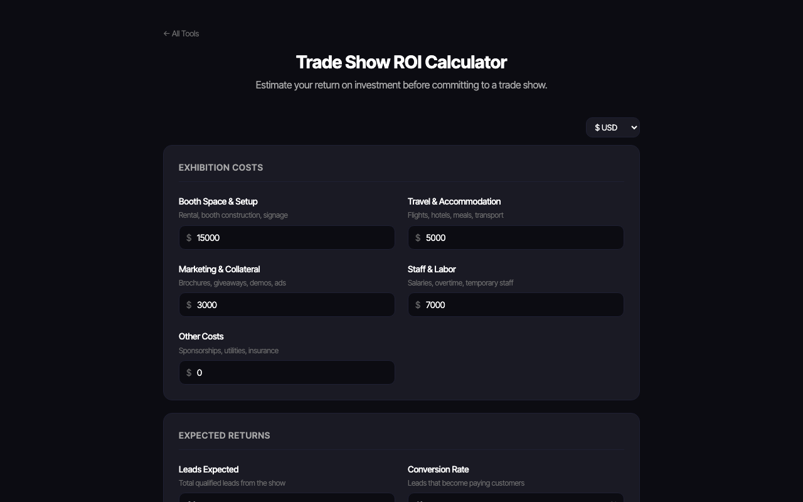
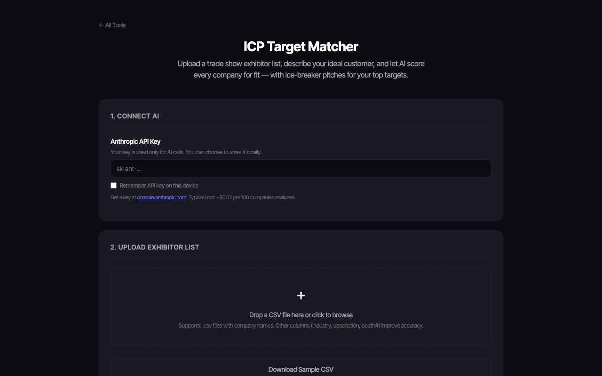
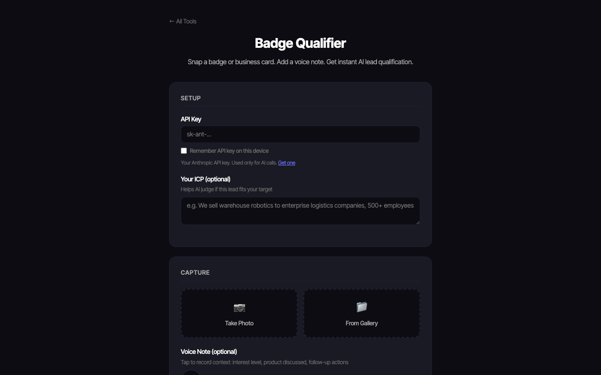

<p align="center">
  <a href="https://www.lensmor.com/?utm_source=github&utm_medium=readme&utm_campaign=trade-show-tools">
    
  </a>
</p>

# Trade Show Tools

[](https://github.com/LensmorOfficial/trade-show-tools/stargazers)
[](https://github.com/LensmorOfficial/trade-show-tools/commits/main)
[](LICENSE)
[](https://lensmorofficial.github.io/trade-show-tools/)

**10 free tools for B2B trade show teams.** No signup. No required backend. Works in browser.

**[Open the tools →](https://lensmorofficial.github.io/trade-show-tools/)** | Built by [Lensmor](https://www.lensmor.com/?utm_source=github&utm_medium=readme&utm_campaign=trade-show-tools)

> If you find these tools useful, a star helps others discover them.

---

## The Problem

Trade show teams waste hours on tasks that should take minutes: manually scoring exhibitor lists, typing follow-up emails one by one, guessing at ROI, and losing competitive intel captured on scraps of paper. These tools automate the repetitive parts so you can focus on the conversations that matter.

---

## Screenshots

[](https://lensmorofficial.github.io/trade-show-tools/)

| ROI Calculator | ICP Matcher | Badge Qualifier |
|---|---|---|
| [](https://lensmorofficial.github.io/trade-show-tools/roi-calculator/) | [](https://lensmorofficial.github.io/trade-show-tools/icp-matcher/) | [](https://lensmorofficial.github.io/trade-show-tools/badge-qualifier/) |

---

## Tools

> Tools marked **(BYOK)** require a free Anthropic API key ([get one here](https://console.anthropic.com/)). No key needed for the calculator, planner, and checklist.

| Tool | What It Does | Requires |
|------|-------------|---------|
| [ROI Calculator](https://lensmorofficial.github.io/trade-show-tools/roi-calculator/) | Enter costs + expected leads + deal size → get ROI %, cost per lead, break-even analysis | None |
| [Budget Planner](https://lensmorofficial.github.io/trade-show-tools/budget-planner/) | Input total budget + booth size + team size → CEIR-benchmarked spend allocation across 8 categories | None |
| [Checklist Generator](https://lensmorofficial.github.io/trade-show-tools/checklist-generator/) | Enter show date + goal → get a 9-phase prep checklist with deadline dates and interactive checkboxes | None |
| [ICP Target Matcher](https://lensmorofficial.github.io/trade-show-tools/icp-matcher/) | Upload exhibitor CSV + describe your ICP → every company scored hot/warm/cold with ice-breaker pitches | BYOK |
| [Badge Qualifier](https://lensmorofficial.github.io/trade-show-tools/badge-qualifier/) | Snap a badge photo → instant lead qualification with authority score, ICP fit, and CRM-ready data | BYOK |
| [Outreach Generator](https://lensmorofficial.github.io/trade-show-tools/outreach-generator/) | Upload post-show leads CSV → personalized follow-up emails and LinkedIn messages for every contact | BYOK |
| [Floor Plan Extractor](https://lensmorofficial.github.io/trade-show-tools/floorplan-extractor/) | Upload floor plan image/PDF → extract all booth numbers and companies into a CRM-ready lead list | BYOK |
| [Competitor Radar](https://lensmorofficial.github.io/trade-show-tools/competitor-radar/) | Log competitor booth photos + voice notes on the show floor → auto-generate competitive battlecard | BYOK |
| [Booth Location Scorer](https://lensmorofficial.github.io/trade-show-tools/booth-scorer/) | Mark your booth on a floor plan → get an AI grade (A–F) with foot traffic analysis and positioning tips | BYOK |
| [Show Selection Scorer](https://lensmorofficial.github.io/trade-show-tools/show-selection-scorer/) | Score shows across 6 dimensions (audience fit, timing, budget, etc.) → get Priority / Consider / Skip with CSV export | None |

---

## Quick Start

**No-AI tools** (ROI Calculator, Budget Planner, Checklist Generator, Show Selection Scorer) — open and use immediately, no setup.

**AI tools** — get a free Anthropic API key at [console.anthropic.com](https://console.anthropic.com/), paste it in the tool, and you're ready. Keys are stored locally in your browser. The default hosted version calls Anthropic directly — your key never touches our servers. (Teams self-hosting the optional proxy are responsible for their own data handling.)

---

## Embed on Your Website

Any tool can be embedded via iframe:

```html
<iframe
  src="https://lensmorofficial.github.io/trade-show-tools/roi-calculator/"
  width="100%"
  height="900"
  frameborder="0"
  title="Trade Show ROI Calculator">
</iframe>
```

---

## Tech Stack

- Pure HTML, CSS, JavaScript — no frameworks, no build step
- Hosted on GitHub Pages — free, fast, always on
- Mobile responsive
- Works offline after first load (except AI calls)

---

## About Lensmor

[Lensmor](https://www.lensmor.com/?utm_source=github&utm_medium=readme&utm_campaign=trade-show-tools) is an AI-native event intelligence platform that helps B2B teams discover trade shows, analyze exhibitor lists, and generate [qualified leads](https://www.lensmor.com/blog/trade-show-lead-capture?utm_source=github&utm_medium=readme&utm_campaign=trade-show-tools) before the event starts.

---

## More Open Source from Lensmor

| Repo | Description |
|------|-------------|
| [awesome-trade-shows](https://github.com/LensmorOfficial/awesome-trade-shows) | Curated list of 200+ trade shows across 15 industries |
| [trade-show-calendar](https://github.com/LensmorOfficial/trade-show-calendar) | Open dataset of 133 global trade shows (CSV + JSON) |
| [trade-show-world-map](https://github.com/LensmorOfficial/trade-show-world-map) | Interactive world map of 200+ B2B trade shows |
| [exhibitor-intelligence-playbook](https://github.com/LensmorOfficial/exhibitor-intelligence-playbook) | Complete B2B trade show ROI playbook (6 chapters) |
| [trade-show-skills](https://github.com/LensmorOfficial/trade-show-skills) | Claude Code AI skills for trade show research and automation |
| [trade-show-email-templates](https://github.com/LensmorOfficial/trade-show-email-templates) | 16 ready-to-use email templates for trade show outreach |
| [event-tech-landscape](https://github.com/LensmorOfficial/event-tech-landscape) | Map of 80+ tools powering the event industry |

---

## Contributing

Found a bug, have a tool idea, or want to improve an existing tool? Read [CONTRIBUTING.md](CONTRIBUTING.md).

## License

[MIT](LICENSE)
